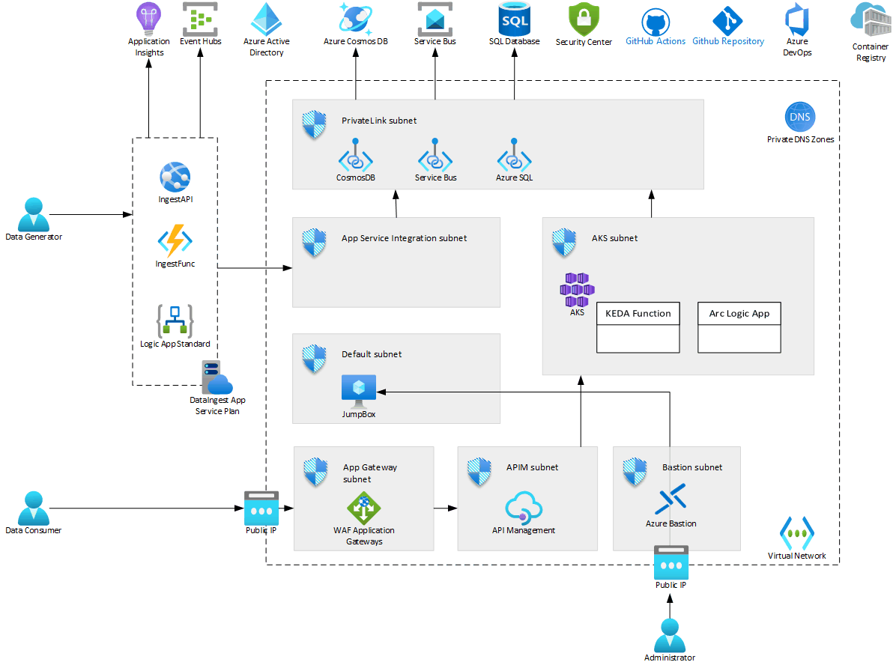

# AzureAppDemoEnvironment

Data Ingest

- [x] App Service API
- [x] send to EventHub
- [x] Azure Function EventHub trigger
- [x] Save to CosmosDB on Private Endpoint using Managed Identity

Integration

- [ ] Function runtime in AKS CosmosDB changefeed trigger
- [ ] Publish to Azure Service Bus on Private Endpoint

Subscribers Flow 1

- [ ] Logic App Consumption tier subscriber to Service Bus
- [ ] Transform workflow
- [ ] Save to SQL Server

Subscribers Flow 2

- [ ] Logic App Standard tier subscriber to Service Bus
- [ ] Transform workflow
- [ ] Save to CosmosDB

API Query

- [ ] Query API Management through Application Gateway
- [ ] Implement OAuth
- [ ] Split API call
- [ ] Call Function to query CosmosDB
- [ ] Call Function to query SQL Server
- [ ] Combine results
- [ ] Return

Management and Operations

- [x] Application Insights
- [x] Azure Bastion
- [x] JumpBox

Deploy

- [ ] Use Github Actions
- [ ] Use ADO Pipelines
- [ ] Use ADO Boards
- [ ] Integrate ADO with Github

